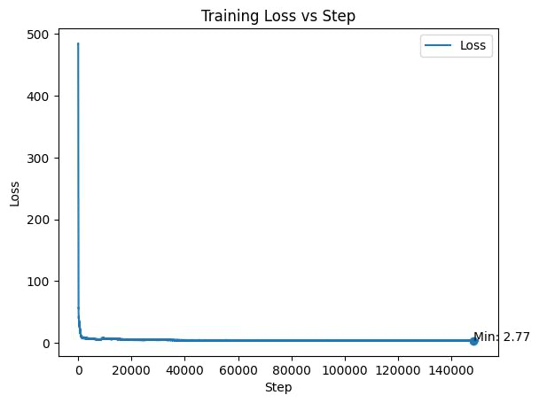
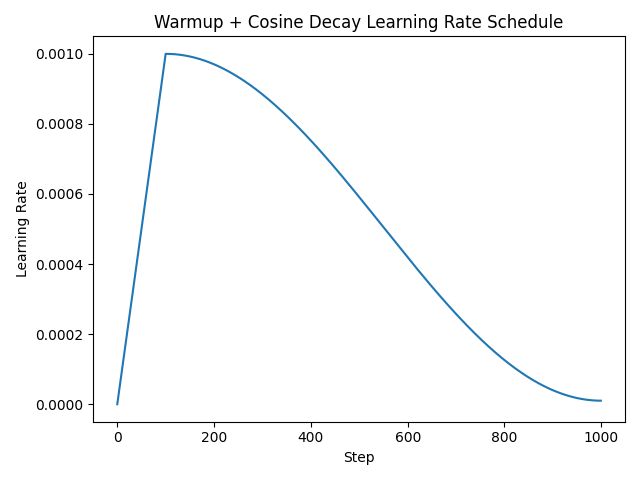

# GPT-2 from Scratch

A clean, from-scratch PyTorch implementation of GPT-2 with full training and inference support.  
The project is split into two implementations: a base model that faithfully follows the original GPT-2 paper, and a custom modular version for ablation studies (currently under development).

---

## Project Structure

```
GPT2/
├── base/
│   ├── model/
│   │   ├── attn.py          # Multi-head attention with KV caching
│   │   ├── transformer.py   # Transformer block (pre-norm, GELU MLP)
│   │   └── gpt2.py          # Full GPT-2 model
│   └── train_utils/
│       ├── utils.py         # LR scheduler, checkpoint save/load
│       └── config.json      # Training hyperparameters
├── custom/                  # Modular ablation model (under development)
├── gpt2_train.py            # Training entry point
├── gpt2_infer.py            # Inference entry point
├── test_gpt2.py             # Forward pass + KV cache tests
└── config.json              # Model architecture config
```

---

## Architecture — Base Model

The base GPT-2 follows the original OpenAI architecture as described in *Language Models are Unsupervised Multitask Learners*.

### Embeddings

- **Token Embedding (`wte`)** — learnable embedding matrix of shape `(vocab_size, d_model)`. Maps each token ID to a `d_model`-dimensional vector.
- **Positional Embedding (`wpe`)** — learnable embedding matrix of shape `(max_seq_len, d_model)`. Encodes absolute position in the sequence.
- The two are added together at the input: `x = tok_emb + pos_emb`.

### Transformer Blocks

The model stacks `n_blocks` identical transformer blocks. Each block applies:

1. **Pre-norm**: `LayerNorm` is applied *before* the sublayer (attention or MLP), not after. This is the GPT-2 convention and improves training stability.
2. **Multi-Head Self-Attention** with causal masking.
3. **Residual connection** around attention.
4. **Pre-norm** again before MLP.
5. **Feed-Forward MLP** — two linear projections with GELU in between, expanding to `4 * d_model` in the hidden layer.
6. **Residual connection** around MLP.

### Attention

- Uses a fused `(Q, K, V)` projection: a single `Linear(d_model, 3 * d_model)` layer.
- Splits into Q, K, V and reshapes into `(B, T, n_heads, head_dim)`.
- Uses `torch.nn.functional.scaled_dot_product_attention` (FlashAttention-compatible) with causal masking.

### Output

- Final `LayerNorm` applied to the last hidden state.
- Linear projection `lm_head: Linear(d_model, vocab_size, bias=False)`.
- **Weight tying**: `lm_head.weight` is shared with `wte.weight`, following the original GPT-2 design. This reduces parameter count and improves sample quality.

### Default Configuration (GPT-2 124M)

| Hyperparameter | Value |
|---|---|
| `vocab_size` | 50,257 |
| `max_seq_len` | 1,024 |
| `d_model` | 768 |
| `n_heads` | 12 |
| `n_blocks` | 12 |
| `hidden_dim` (MLP) | 3,072 (4 × d_model) |

---

## Training

### Dataset

The model is trained on the **FineWeb** dataset (HuggingFace), a large-scale, high-quality filtered web corpus. Sequences are chunked to `max_seq_len` tokens and fed as `(input, target)` pairs where target is the input shifted by one position.

### Optimizer

**AdamW** with the following settings:

- `betas = (0.9, 0.95)` — standard values from the GPT-2/GPT-3 papers.
- **Decoupled weight decay**: parameters with `dim >= 2` (weight matrices) get `weight_decay = 0.1`; biases and LayerNorm parameters (`dim < 2`) are excluded.
- **Fused AdamW** used when CUDA is available for faster parameter updates.

### Learning Rate Schedule

A **warmup + cosine decay** schedule:

1. **Linear warmup** from 0 to `max_lr` over `warmup_steps` steps.
2. **Cosine decay** from `max_lr` down to `min_lr` over the remaining steps.

| Parameter | Value |
|---|---|
| `learning_rate` | 3e-4 |
| `min_lr` | 3e-5 |
| `warmup_steps` | 2,000 |
| `max_steps` | 150,000 |

### Gradient Accumulation

Gradients are accumulated over `grad_accum_steps = 8` mini-batches before each optimizer step. This simulates a larger effective batch size without requiring more GPU memory:

```
effective_batch = batch_size × grad_accum_steps × max_seq_len
                = 8 × 8 × 1024 = 65,536 tokens/step
```

Each micro-batch loss is divided by `grad_accum_steps` before `.backward()` to keep the scale consistent.

### Gradient Clipping

`torch.nn.utils.clip_grad_norm_` clips the global gradient norm to `1.0` before each optimizer step. This prevents gradient explosion events from derailing training.

### Mixed Precision Training

- **CUDA**: trains in `bfloat16` if the GPU supports it (Ampere+), otherwise `float16`.
- **MPS / CPU**: falls back to `float16`.
- Wrapped with `torch.autocast` for automatic casting of eligible ops.
- **TF32** is enabled on Ampere+ GPUs (`torch.set_float32_matmul_precision("high")`) for faster matrix multiplications in full-precision fallback paths.

### Checkpointing

Checkpoints are saved every `save_every` steps and at the end of training. Each checkpoint stores:
- `model_state_dict`
- `optimizer_state_dict`
- `step` and `tokens_seen`
- Full `config` dict

Supports two resume modes:
- `--resume <path>` — resume from a checkpoint, continuing the LR schedule from the saved step.
- `--continue_training <path>` — load weights and optimizer state, but reset the step counter to 0 (useful for continued training on new data).

### Logging

Two logs are written during training:
- `gpt2/results/training_log.csv` — per-step metrics: loss, lr, tokens seen, tokens/sec, step time.
- `gpt2/results/training_output.log` — human-readable training output.

### Training Curves

**Loss curve** — 150,000 steps on FineWeb, final loss **2.77**:



**Learning rate schedule** — linear warmup → cosine decay:



---

## Inference

### Tokenizer

Uses **tiktoken** with the `gpt2` encoding — the same BPE tokenizer used in the original GPT-2 model. Vocabulary size is 50,257 tokens.

### Two-Phase Generation (Prefill + Decode)

Generation is split into two stages to efficiently use a KV cache:

**Phase 1 — Prefill**  
The full prompt is processed in a single forward pass. At each attention layer, the Key and Value tensors for every prompt token are computed and stored in a per-layer cache. This is `O(T)` work where `T` is the prompt length.

**Phase 2 — Decode**  
For each new token, only that single token is fed into the model. Each attention layer reads the full cached K/V from the prompt (and all previously generated tokens) but only computes Q for the new token. The cache is extended by one position at each step. This keeps decoding at `O(1)` per step instead of recomputing the full sequence.

### Sampling

At each decode step:

1. **Temperature scaling** — logits are divided by `temperature` to control sharpness. Lower temperature → more deterministic.
2. **Top-k filtering** — tokens outside the top-k logits are masked to `-inf` before softmax.
3. **Multinomial sampling** — a token is sampled from the resulting probability distribution.

The generator yields one decoded text chunk per step (streaming output).

### Running Inference

```bash
# Single prompt
python gpt2_infer.py --checkpoint path/to/checkpoint.pt --prompt "Once upon a time"

# Interactive mode
python gpt2_infer.py --checkpoint path/to/checkpoint.pt --interactive

# With custom sampling settings
python gpt2_infer.py --checkpoint path/to/checkpoint.pt \
    --prompt "The capital of France" \
    --max_tokens 200 \
    --temperature 0.7 \
    --top_k 40
```

---

## Pipeline

```
Data (FineWeb)
    |
    | Chunked into (input, target) pairs of length max_seq_len
    v
Training  (gpt2_train.py)
    |
    | AdamW + warmup-cosine LR + grad accumulation + mixed precision
    | Saves checkpoints every N steps
    v
Checkpoint (.pt file)
    |
    | Loads model weights + config
    v
Inference  (gpt2_infer.py)
    |
    | Prefill prompt → KV cache
    | Decode loop → top-k sampling + temperature
    v
Generated Text (streamed token by token)
```

---

## Running the Tests

```bash
# Test base model: forward pass + prefill/decode correctness
python test_gpt2.py
```

This verifies:
- Forward pass output shape `(B, T, vocab_size)`
- Prefill output shape matches
- Decode with KV cache produces shape `(B, 1, vocab_size)`

---

## Custom Model (Under Development)

A modular version of GPT-2 under `custom/` is being developed to support ablation studies across:

- **Positional embeddings**: absolute (learnable), sinusoidal (fixed), RoPE
- **Activation functions**: GeLU, ReLU, SiLU, SwiGLU, GeGLU
- **Normalization**: LayerNorm, RMSNorm
- **Norm position**: pre-norm, post-norm

Each configuration auto-generates a descriptive model name (e.g., `gpt2_rope_silu_rmsnorm_post`) for saving and comparison.

---

## Benchmark — Inference Throughput

Measured with `benchmark.py` on a **124M-parameter GPT-2** (step 150,000, 9.8B tokens seen).  
Prompt: `"Once upon a time in a land far away"`, generating **200 tokens**, **3 timed runs** per device.

| Device | Avg tok/s | Std dev |
|--------|----------:|--------:|
| **MPS** (Apple Silicon GPU) | **47.9** | ± 3.8 |
| **CPU** | **49.8** | ± 1.4 |

> **Note:** MPS and CPU are running comparable speeds on this model size. MPS throughput is expected to scale more favorably on longer sequences and larger batch sizes due to GPU parallelism.  
> No CUDA GPU was present in this environment.

### Running the benchmark yourself

```bash
# All available devices (auto-detected)
python benchmark.py --checkpoint checkpoints/step_150000_final.pt

# Specific devices
python benchmark.py --checkpoint checkpoints/step_150000_final.pt --devices cuda,cpu

# Longer/more rigorous run
python benchmark.py --checkpoint checkpoints/step_150000_final.pt --max_tokens 500 --runs 5
```

---
